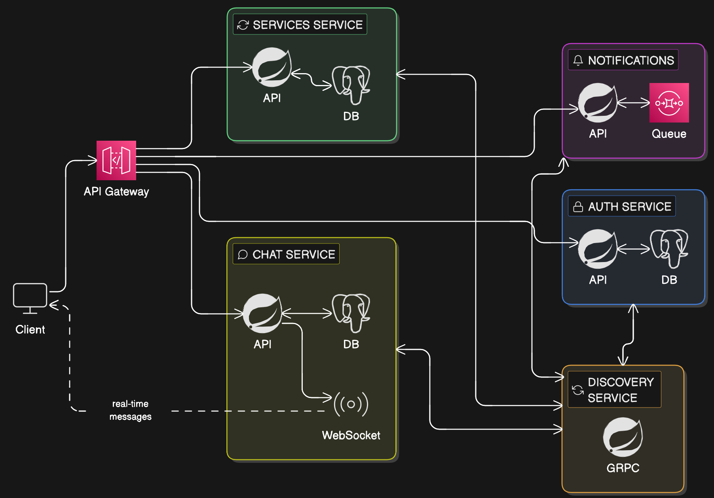

# service-4-me
A peer to peer platform for exchanging services

# Backend Architecture
The backend follows a microservices architecture.


## Run backend locally (single command)

From project root:

- Start all backend services (discovery -> core services -> gateway):
	- `bash backend/scripts/start-local.sh`
- Stop all started services:
	- `bash backend/scripts/stop-local.sh`

The start script uses the `local` Spring profile and writes:

- logs to `backend/.run/logs`
- pids to `backend/.run/pids`

## Run specific services via Docker Compose

If you want to run specific services in Docker while developing others locally in your IDE, use the Docker Compose setup.

First, build the `.jar` files for the services:
```bash
cd backend && ./mvnw clean package -DskipTests && cd ..
```

Start selectively (e.g., start only `auth-service` and `chat-service`):
```bash
docker compose -f backend/compose.yaml up -d auth-service chat-service
```

To rebuild and update a specific service after making changes:
```bash
docker compose -f backend/compose.yaml -f backend/docker-compose.services.yml up -d --build auth-service
```